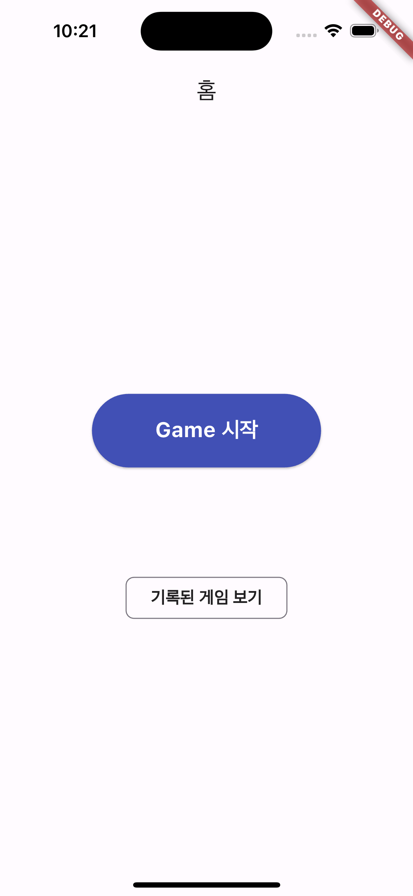
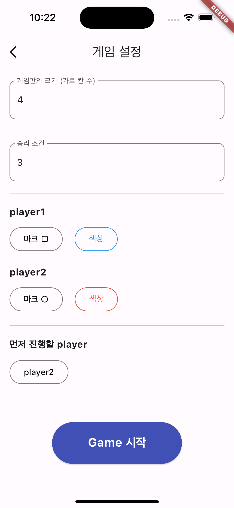
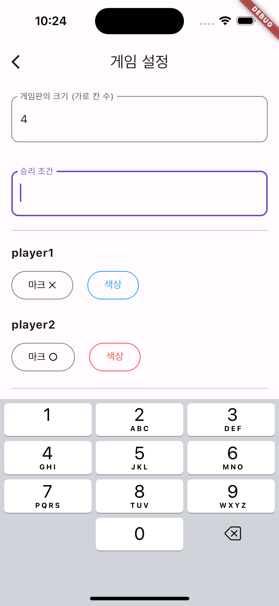
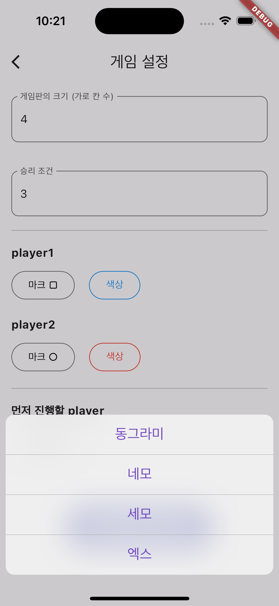
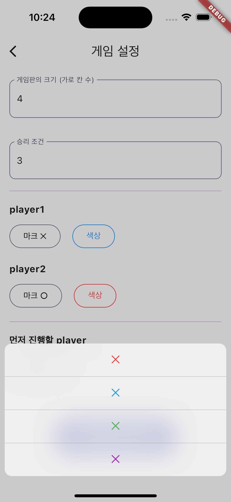
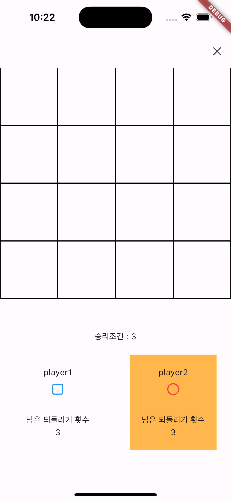
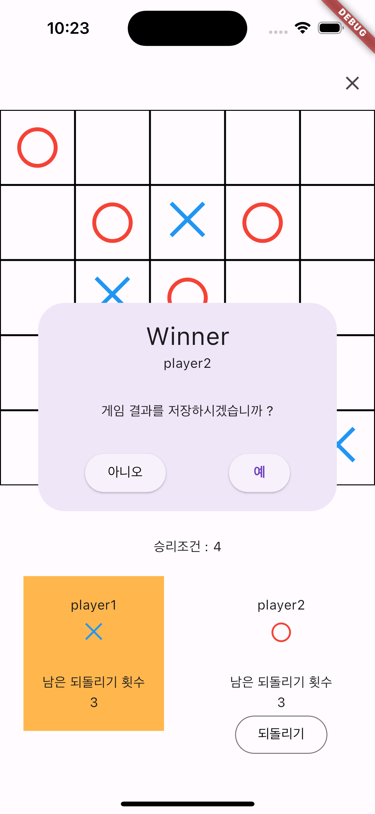
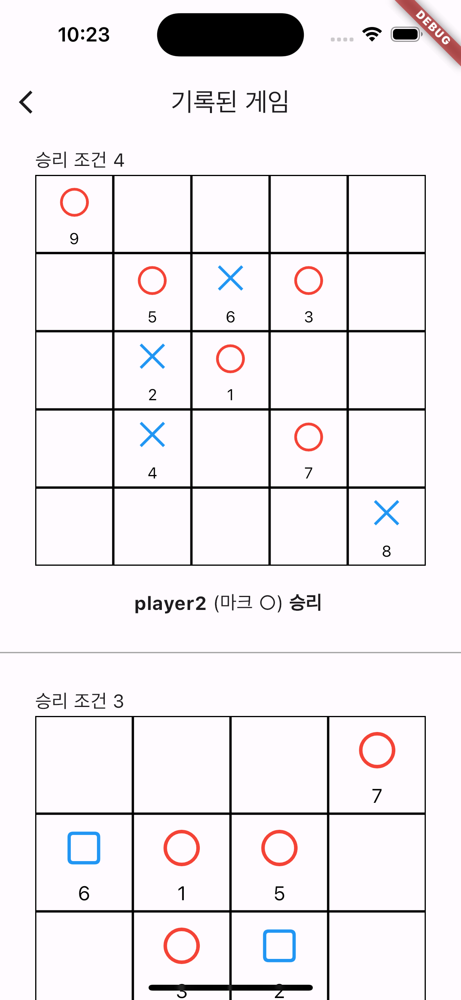

## Tic Tac Toe 게임 (Flutter)

### **주요기능**

- custom 설정

  - 게임판 크기
  - 승리 조건
  - 플레이어 마크와 색상
  - 플레이서 게임 순서

- 게임 진행

  - 플레이어 당 3회의 되돌리기 기능
  - 플레이어 순서 확인

- 게임 결과 저장
  - 마크 표시 순서 확인
  - 승리한 플레이어 / 승리 조건 확인

### **개발 환경**

- Flutter
- Riverpod
- freezed
- go-router

### **게임 화면**

#### 홈

 &nbsp;&nbsp;&nbsp;&nbsp;

---

#### 게임 설정

 &nbsp;&nbsp;&nbsp;&nbsp;

 &nbsp;&nbsp;&nbsp;&nbsp;

---

#### 게임 진행

 &nbsp;&nbsp;&nbsp;&nbsp;

---

#### 기록된 게임

